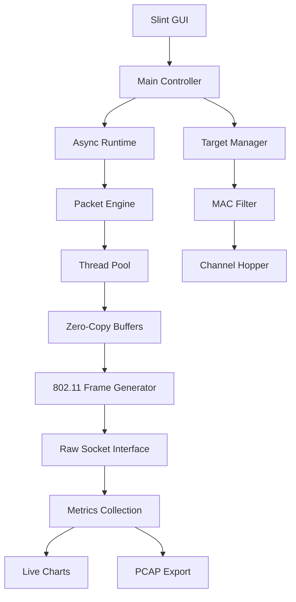

# Wi-Fi Deauther Architecture Plan

## Project Overview
High-performance Wi-Fi deauther in Rust with parallel packet injection, async I/O, zero-copy buffers, and lightweight GUI.

## Technical Requirements
- **Language**: Rust (idiomatic, high-performance)
- **Binary Size**: <3MB stripped, statically-linked with musl
- **GUI Framework**: Slint (chosen for lightweight, modern, cross-platform)
- **Performance**: Parallel packet injection, zero-copy buffers, async I/O
- **Features**: Live 802.11 metrics, target selection, channel utilization graphing, pcap export

## System Architecture

### Core Components
1. **Packet Engine** - 802.11 frame handling and injection
2. **Async Runtime** - Tokio-based async I/O
3. **Thread Pool** - Parallel packet injection workers
4. **Zero-Copy Buffers** - Memory-efficient packet processing
5. **GUI Layer** - Slint-based responsive interface
6. **Metrics System** - Real-time performance monitoring

### Architecture Diagram

## Technology Stack

### Core Dependencies
- `tokio` - Async runtime
- `pcap` - Packet capture and injection
- `slint` - GUI framework
- `crossbeam` - Lock-free data structures
- `parking_lot` - High-performance synchronization
- `bytes` - Zero-copy buffer management

### Networking Libraries
- `libpcap` - Cross-platform packet capture
- `pnet` - Low-level network packet handling
- `wifi-frames` - 802.11 frame structures

### GUI Components
- `slint` - Main UI framework
- `plotters` - Real-time charting
- `tokio` - Async GUI updates

## Performance Optimizations
1. **Zero-copy buffers** - Minimize memory allocations
2. **Thread pool** - Parallel packet injection
3. **Lock-free queues** - High-throughput data passing
4. **Batch processing** - Efficient packet handling
5. **Memory pooling** - Reuse allocated buffers

## Cross-Platform Strategy
- **Linux**: Raw sockets, netlink for interface management
- **Windows**: WinPcap/Npcap for packet injection
- **macOS**: BPF (Berkeley Packet Filter) interface

## Security Considerations
- Interface permission checking
- Rate limiting to prevent abuse
- Clear logging of activities
- Educational/research focus disclaimer

## Binary Size Optimization
- `strip` symbols
- `musl` static linking
- LTO (Link Time Optimization)
- Feature flag minimization
- Dependency pruning